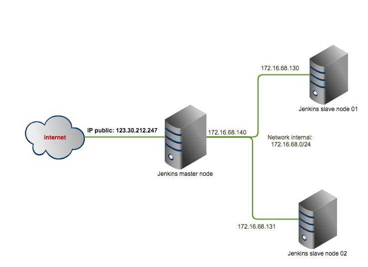

### Updating
------------

#### Installing Jenkins master-slave
This guide is to show how to setup Jenkins multi-nodes with master-slave architecture. And Jenkins master node will connect with slave nodes via user/password.

##### 1. Architecture

##### 2. Install Jenkins master

##### 3. Install Jenkins slave

##### 4. Add node to Jenkins master
