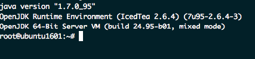

### Installing Jenkins on Ubuntu 16.04
--------------------------------------

This guide is to install Jenkins on Ubuntu 16.04. Please make sure that your system already was updated and running commands with root privilege.

#### Step 1: Install Java OpenJDK 8

```
sudo apt update
sudo apt install python-software-properties apt-transport-https -y
sudo add-apt-repository ppa:openjdk-r/ppa
sudo apt update
sudo apt install openjdk-8-jdk -y
```

Verify Java after installing

```
java -version
```

The command should be have a result like this:



#### Step 2: Install Jenkins

Add Jenkins key and repository to the system with the command below.
```
wget -q -O - https://pkg.jenkins.io/debian-stable/jenkins.io.key | sudo apt-key add -
echo 'deb https://pkg.jenkins.io/debian-stable binary/' | tee -a /etc/apt/sources.list
```

Update repository and install Jenkins

```
sudo apt update
sudo apt install jenkins -y
```

Restart daemon and Jenkins.
```
systemctl restart jenkins
```

After running Jenkins then it will be open port 8080. Check it by this command:

```
netstart -an | grep 8080
```

#### Bonus information

- [How to open Jenkins with port 80 or 443](https://wiki.jenkins.io/display/JENKINS/Running+Jenkins+on+Port+80+or+443+using+iptables)

TD;TR: Iptables commands is to redirect packets from 80 to 8080 and  443 to 8443

```
sudo iptables -A PREROUTING -t nat -i eth0 -p tcp --dport 80 -j REDIRECT --to-port 8080
sudo iptables -A PREROUTING -t nat -i eth0 -p tcp --dport 443 -j REDIRECT --to-port 8443
```
Save Iptables on Ubuntu 16.04

```
sudo apt install iptables-persistent -y
sudo netfilter-persistent save
sudo netfilter-persistent reload
```

#### References
[1] https://www.howtoforge.com/tutorial/how-to-install-jenkins-with-apache-on-ubuntu-16-04/

[2] https://stackoverflow.com/questions/39621263/jenkins-fails-when-running-service-start-jenkins
