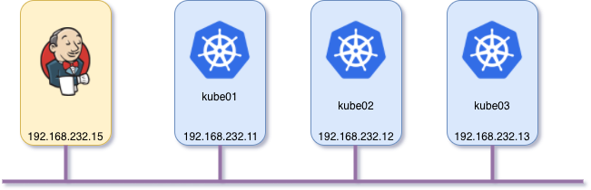

### Setup Jenkins to get K8S as backend for Slave


#### 1. Topology



Note: During this article, the steps will use IP as this topology.

#### 2. Install

**Step 1: Install Jenkins**

Before you setup configuration for Jenkins then you have to install Jenkins on CentOS 7 or Ubuntu 16.04. Please this [link](./install_jenkins_ubuntu.md) for more detail.

**Step 2. Install Kubernetes**

This article will guide how to install K8S with one master node (kube01) and two agents node (kube02 and kube03) on **CentOS7**.

Step 2.1. Install common services on **three nodes**.

Note: Run the below commands on three nodes.

- Setup hosts file
```
echo >> /etc/hosts <<EOF
192.168.232.11 kube1
192.168.232.12 kube2
192.168.232.13 kube3
EOF
```

- Disable SELinux and Swap

Why we need to disable swap, refer this [link](https://serverfault.com/questions/881517/why-disable-swap-on-kubernetes).

```
setenforce 0
sed -i --follow-symlinks 's/SELINUX=enforcing/SELINUX=disabled/g' /etc/sysconfig/selinux
swapoff -a
```

We must also ensure that swap isn't re-enabled during a reboot on each server. Open up the /etc/fstab and comment out the swap entry like this:

```
# /dev/mapper/centos-swap swap swap defaults 0 0
```

- Enable br_netfilter

```
modprobe br_netfilter
echo '1' > /proc/sys/net/bridge/bridge-nf-call-iptables
```

- Install Docker-CE

```
yum install -y yum-utils device-mapper-persistent-data lvm2

yum-config-manager --add-repo https://download.docker.com/linux/centos/docker-ce.repo

yum install -y docker-ce
```

- Start and enable Docker

```
systemctl start docker
systemctl enable docker
```

- Disable firewalld

Note: I am not refer this method, you should check the command of firewalld and open specify ports for K8S.

```
systemctl stop firewalld
systemctl disable firewalld
```

- Cgroup changes

Now we need to ensure that both Docker-ce and Kubernetes belong to the same control group (cgroup). By default, Docker should already belong to cgroupfs (you can check this with the command docker info | grep -i cgroup). To add Kubernetes to this, add `cgroup_driver` option to Environment like this:

```
Environment="KUBELET_KUBECONFIG_ARGS=--bootstrap-kubeconfig=/etc/kubernetes/bootstrap-kubelet.conf --kubeconfig=/etc/kubernetes/kubelet.conf --cgroup-driver=cgroupfs"
```

- Restart the systemd daemon and the kubelet service with the commands:

```
systemctl daemon-reload
systemctl restart kubelet
```

Done, all steps which need to be run on three nodes were done. From now on, you will action on each node.

Step 2.2. Initialize the Kubernetes cluster (running on kube01-master node)

```
kubeadm init --apiserver-advertise-address=192.168.232.11 --pod-network-cidr=192.168.232.0/16
```

Step 2.3. Join slave node to cluster

Once that completes, head over to kube2 and kube 03 and issue the command.

```
kubeadm join 192.168.232.11:6443 --token TOKEN --discovery-token-ca-cert-hash DISCOVERY_TOKEN
```

Where TOKEN and DISCOVERY_TOKEN are the tokens displayed after the initialization command completes.

- Configuring Kubernetes on kube01

```
mkdir -p $HOME/.kube
sudo cp -i /etc/kubernetes/admin.conf $HOME/.kube/config
sudo chown $(id -u):$(id -g) $HOME/.kube/config
```

- Deploy flannel network on kube01

```
kubectl apply -f https://raw.githubusercontent.com/coreos/flannel/master/Documentation/kube-flannel.yml
```

Step 2.4. Checking your nodes

Run this command on kube01.

```
kubectl get nodes
```

The output should be like this:

```
NAME    STATUS     ROLES    AGE   VERSION
kube1   Ready      master   82m   v1.12.1
kube2   Ready      <none>   80m   v1.12.1
kube3   Ready      <none>   80m   v1.12.1
```

- Finish installing K8S.

#### 3. Configuration

Step 3.1. Configuration Certificates K8S for Jenkins.

In oder to controll K8S then Jenkins need to have Kubernetes's certificates. At this step, I will guide how to get certificates from K8S.

Access to kube01 and run the below command to get certificates.

```
mkdir ~/cert

cat ~/.kube/config  | grep certificate-authority-data | awk -F ": " {'print $2'} | base64 -d > ~/cert/ca.crt

cat ~/.kube/config  | grep client-certificate-data | awk -F ": " {'print $2'} | base64 -d > ~/cert/client.crt

cat ~/.kube/config  | grep client-key-data | awk -F ": " {'print $2'} | base64 -d > ~/cert/client.key
```

- Client P12 Certificate File

```
openssl pkcs12 -export -out ~/cert/cert.pfx -inkey ~/cert/client.key -in ~/cert/client.crt -certfile ~/cert/ca.crt
```
**NOTE:** It is important that you provide a passphrase


#### 4. Reference links

[1] https://www.techrepublic.com/article/how-to-install-a-kubernetes-cluster-on-centos-7/
[2] https://illya-chekrygin.com/2017/08/26/configuring-certificates-for-jenkins-kubernetes-plugin-0-12/
